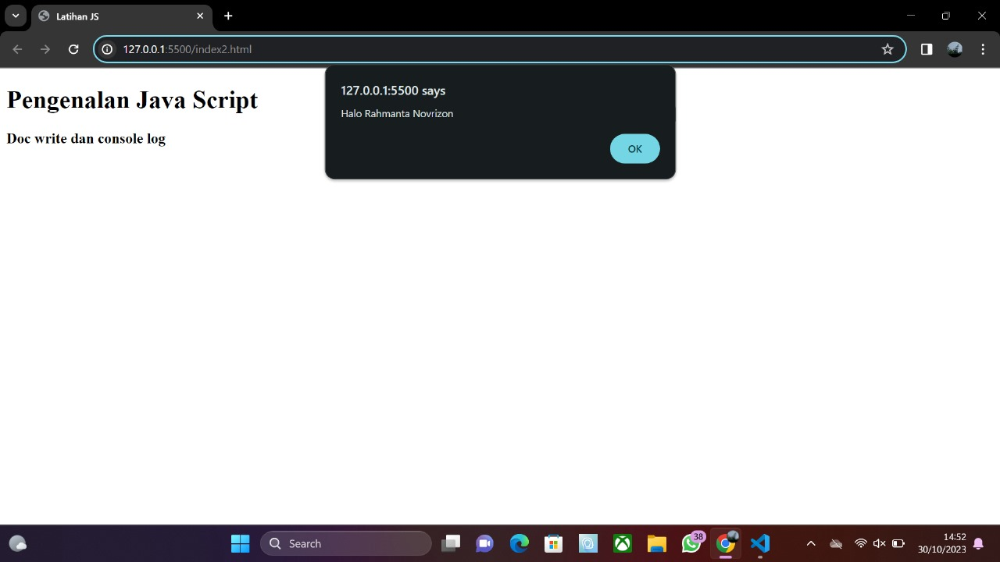
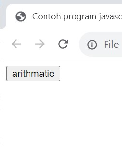
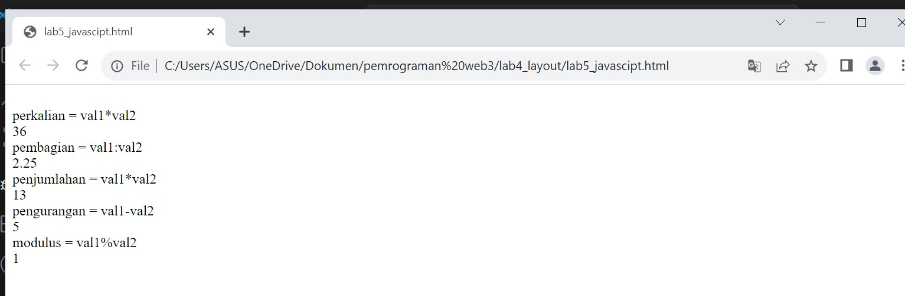
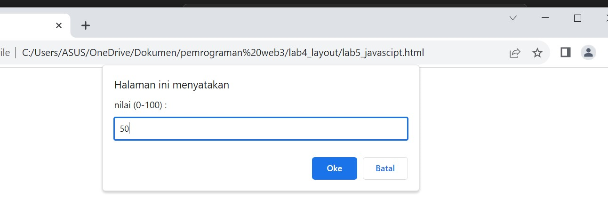
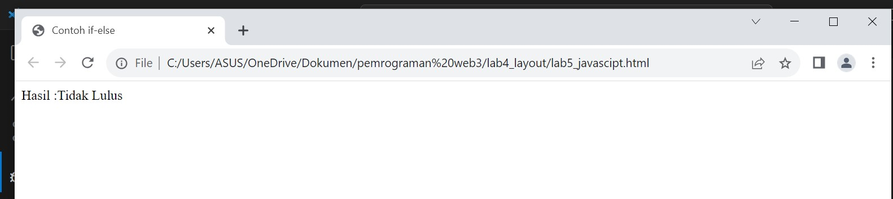
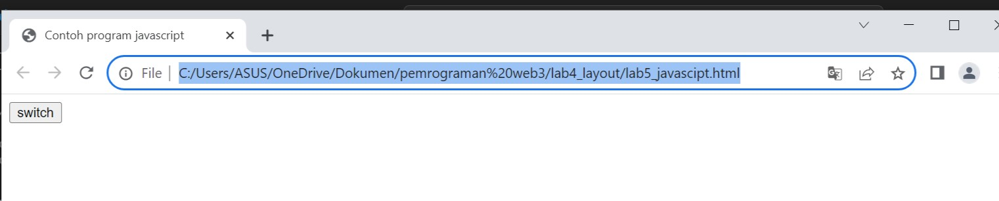
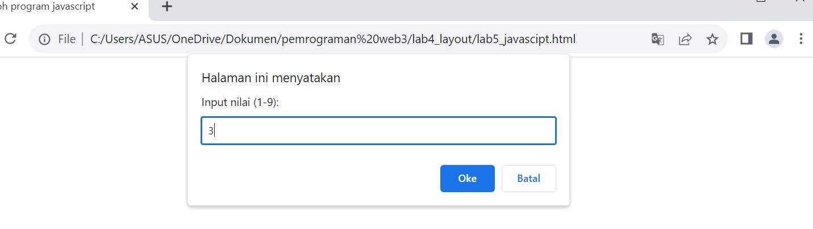

# Lab5web
## Langkah-langkah Praktikum
### Persiapan membuat dokumen HTML dengan nama file lab5_javascript.html seperti berikut.

```
<!DOCTYPE html>
<html lang="en">
<head>
    <meta charset="UTF-8">
    <meta name="viewport" content="width=device-width, initial-scale=1.0">
    <title>Mengenal javascript</title>
</head>
<body>
    <h1>Pengenalan JavaScript</h1>
    <h3>Contoh document.write dan console.log</h3>
    <script>
        document.write("Hello World");
        console.log("Hello World");
</script>
</body>
</html>
```

- Output :


### Javascrip Dasar
- Pemakaian Alert sebagai property window.

```
<!DOCTYPE html>
<html lang="en">
<head>
    <meta charset="UTF-8">
    <meta name="viewport" content="width=device-width, initial-scale=1.0">
    <title>alert box</title>
</head>
<body>
    <script language="javascript">
        window.alert("Ini sebuah pesan untuk anda")
    </script>
</body>
</html>
```

- Output:


### Pemakaian method dalam objek
```
<!DOCTYPE html>
<html lang="en">
<head>
    <meta charset="UTF-8">
    <meta name="viewport" content="width=device-width, initial-scale=1.0">
    <title>script javascript</title>
</head>
<body>
    Percobaan Memakai javascript : <br>
    <script language="javascript">
        document.write("Selamat Mencoba Javascript <br>");
        document.write("Semoga Sukses");
    </script>
</body>
</html>
```

- Output:


### Pemakaian Prompt

```
<!DOCTYPE html>
<html lang="en">
<head>
    <meta charset="UTF-8">
    <meta name="viewport" content="width=device-width, initial-scale=1.0">
    <title>pemasukan data</title>
</head>
<body>
    <script language="javascript">
        var nama = prompt("Siapa nama anda?", "Masukan nama anda");
        document.write("hai, " + nama )
    </script>
</body>
</html>
```

- Output :




### Pembuatan fungsi dan cara pemanggilannya
```
<!DOCTYPE html>
<html lang="en">
<head>
    <meta charset="UTF-8">
    <meta name="viewport" content="width=device-width, initial-scale=1.0">
    <title>Contoh program javascript</title>
    <script language = "javascript">
        function pesan() {
            alert ("Memanggil javascript lewat body onload")
        }
    </script>
</head>
<body onload= pesan()>
</body>
</html>
```

- Output :


### Dasar Pemrograman Di Javascript
- Operasi dasar aritmatika
```
<!DOCTYPE html>
<html lang="en">
<head>
    <meta charset="UTF-8">
    <meta name="viewport" content="width=device-width, initial-scale=1.0">
    <title>Contoh program javascript</title>

    <script language="javascript">
        function test (val1, val2)
        {
            document.write("<br>" + "perkalian = val1*val2" + "<br>")
            document.write(val1*val2)
            document.write("<br>" + "pembagian = val1:val2" + "<br>")
            document.write(val1/val2)
            document.write("<br>" + "penjumlahan = val1*val2" + "<br>")
            document.write(val1+val2)
            document.write("<br>" + "pengurangan = val1-val2" + "<br>")
            document.write(val1-val2)
            document.write("<br>" + "modulus = val1%val2" + "<br>")
            document.write(val1%val2)
        }
    </script>
</head>
<body>
    <input type="button" name="button1" value="arithmatic" onclick=test(9,4)>
</body>
</html>
```

- Output :







### Seleksi kondisi (if..else)

```
<!DOCTYPE html>
<html lang="en">
<head>
    <meta charset="UTF-8">
    <meta name="viewport" content="width=device-width, initial-scale=1.0">
    <title>Contoh if-else</title>
</head>
<body>
    <script language = "javascript">
        var nilai = prompt("nilai (0-100) :", 0);
        var hasil = "";
        if (nilai >= 60)
        hasil = "Lulus";
        else
        hasil = "Tidak Lulus";
        document.write("Hasil :" + hasil);
    </script>
</body>
</html>
```

- Output :







### Penggunaan operator switch untuk seleksi kondisi
```
<!DOCTYPE html>
<html lang="en">
<head>
    <meta charset="UTF-8">
    <meta name="viewport" content="width=device-width, initial-scale=1.0">
    <title>Contoh program javascript</title>
    <script language="javascript">
        function test()
        {
            val1 = window.prompt("Input nilai (1-9): ")
            switch (val1)
            {
                case "1":
                    document.write("bilangin Satu")
                    break
                case "2":
                    document.write("bilangin Dua")
                    break
                case "3":
                    document.write("bilangin Tiga")
                    break
                case "4":
                    document.write("bilangin Empat")
                    break
                case "5":
                    document.write("bilangin Lima")
                    break
                default:
                    document.write("bilangan lainnya")
                
            }
        }
    </script>
</head>
<body>
    <input type="button" name="button1" value="switch" onclick=test()>
</body>
</html>
```

_ Output :

- 1. Jika di isi







- 2. Jika tidak di isi


### Pembuatan Form
```
<!DOCTYPE html>
<html lang="en">
<head>
    <meta charset="UTF-8">
    <meta name="viewport" content="width=device-width, initial-scale=1.0">
    <script>
        function test() {
            var val1 = parseInt(document.kirim.T1.value);
            if (val1 % 2 === 0) {
                document.kirim.T2.value = "Bilangan genap";
            } else {
                document.kirim.T2.value = "Bilangan ganjil";
            }
        }
    </script>
</head>
<body>
    <form method="post" name="kirim">
        <p> BIL <input type="text" name="T1" size="20"> 
        Merupakan BIL <input type="text" name="T2" size="20"></p>
        <p><input type="button" value="TEBAK" name="B1" onclick="test()"></p>
    </form>
</body>
</html>
```

- output :


### Form Button.
```
<!DOCTYPE html>
<html lang="en">
<head> 
    <meta charset="UTF-8">
    <meta name="viewport" content="width=device-width, initial-scale=1.0">
    <title>Object Document</title>
</head>
<body>
    <script language="javascript">
    function ubahwarnaLB(warna) {
        document.bgColor = warna;
    }
    function ubahwarnaLD(warna) {
        document.fgColor = warna;
    }
    </script>
    <h1>TES</h1>
    <from>
        <input type="button" value="Latar belakang hijau" onclick="ubahwarnaLB('green')">
        <input type="button" value="Latar belakang putih" onclick="ubahwarnaLB('white')">
        <input type="button" value="Text Kuning" onclick="ubahwarnaLD('yellow')">
        <input type="button" value="Text Biru" onclick="ubahwarnaLD('blue')">
    </from>
    <script language="javascript">
        document.write("dimodifikasi terakhir pada" + document.lastModified);
    </script>
</body>
</html>
```

- Output :

- Klik latar belakang putih


- Klik latar belakang hijau


- klik Text Kuning


- Klik Text Biru


### HTML DOM
- Pilihan menggunakan checkBox dengan perhitungan otomatis
```
<!DOCTYPE html>
<html lang="en">
<head>
    <meta charset="UTF-8">
    <meta name="viewport" content="width=device-width, initial-scale=1.0">
    <title>Daftar Menu</title>
    <script>
        function hitung(ele) {
            var total = parseFloat(document.getElementById("total").value);
            total = (isNaN(total) ? 0 : total);
            var harga = parseFloat(ele.value);
            if (ele.checked) {
                total += harga;
            } else {
                total -= harga;
            }
            document.getElementById("total").value = total.toFixed(2);
        }
    </script>
</head>
<body>
    <h1>Daftar Menu Makanan</h1>
    <label><input type="checkbox" value="15000" id="Menu1" onclick="hitung(this);" />Ayam Bakar Rp. 15.000</label><br />
    <label><input type="checkbox" value="1500" id="Menu2" onclick="hitung(this);" />Gorengan Rp. 1.500</label><br />
    <label><input type="checkbox" value="5000" id="Menu3" onclick="hitung(this);" />Telur Dadar Rp. 5.000</label><hr />
    <strong>Total Bayar : Rp.<input id="total" type="text" value="0.00" readonly></strong>
</body>
</html>
```

- Output :


### Pertanyaan dan Tugas
### 1. Buat script untuk melakukan validasi pada isian form.
```
<!DOCTYPE html>
<html lang="en">
<head>
    <meta charset="UTF-8">
    <meta name="viewport" content="width=device-width, initial-scale=1.0">
    <link rel="stylesheet" href="style.css">
    <title>Validasi Form</title>

    <script>
        function validateForm() {
            var name = document.forms["myForm"]["name"].value;
            var email = document.forms["myForm"]["email"].value;
            var password = document.forms["myForm"]["password"].value;

            if (name == "") {
                alert("Nama harus diisi");
                return false;
            }

            if (email == "") {
                alert("Email harus diisi");
                return false;
            }

            if (password == "") {
                alert("Password harus diisi");
                return false;
            }

            return true;
        }

        function showError(errorMessage) {
            var errorElement = document.getElementById("error-message");
            errorElement.innerHTML = errorMessage;
        }
    </script>
</head>
<body>
    <h2>Form Validasi</h2>
    <form name="myForm" onsubmit="return validateForm()">
        <label for="name">Nama:</label>
        <input type="text" id="name" name="name">

        <label for="email">Email:</label>
        <input type="email" id="email" name="email">

        <label for="password">Password:</label>
        <input type="password" id="password" name="password">

        <input type="submit" value="Kirim">

        <div id="error-message" class="error"></div>
    </form>
</body>
</html>
```

- Output


### style.css
```
body{
    font-family: Arial, sans-serif;
    background-color: #f4f4f4;
    margin: 0;
    padding: 0;
}

h2 {
    text-align: center;
}

form {
    max-width: 400px;
    margin: 20px auto;
    padding: 20px;
    background-color: burlywood;
    border: 1px solid #ccc;
    border-radius: 5px;
}

label {
    display: block;
    margin-bottom: 5px;
}

input[type="text"],
input[type="email"],
input[type="password"] {
    width: 100%;
    padding: 8px;
    margin-bottom: 10px;
    border: 1px solid #ccc;
    border-radius: 4px;
}

input[type="submit"] {
    background-color: #4CAF50;
    color: #fff;
    padding: 10px 15px;
    border: none;
    border-radius: 4px;
    cursor: pointer;
}

input[type="submit"]:hover {
    background-color: #45a049;
}

.error {
    color: red;
    margin-bottom: 10px;
}
```

- output


